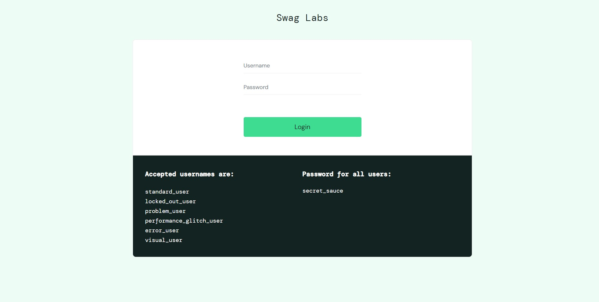
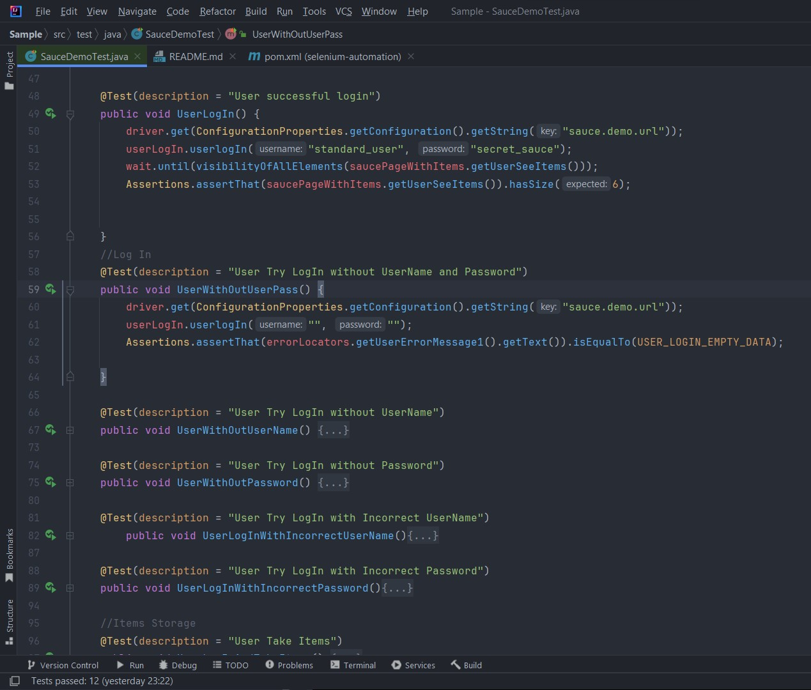

<div align="center">
<h1>
SauceDemo Automation
</h1>
</div>


### About the project:

<div align="center">

</div>
<details>
<summary>Link : </summary>

https://www.saucedemo.com 
</details>


<div align="center">
SauceDemo Automation Test is a project aimed at automating the testing process for the SauceDemo web application. 
<br>The project is created only for automated tests.
Tests are  designed to navigate, interact with, and rigorously validate the diverse functionalities of the SauceDemo webshop.
</div>

### Build With:
Here is Tools and Plugins which was used  for test automation. 
<div>
<details>
<summary>Tools</summary>
<li>
<a href="https://www.jetbrains.com/idea/">
IntellyJ Community Edition
</a>
</li>
<li>
<a href="https://www.selenium.dev/">
Selenium
</a>
</li>
<li>
<a href="https://www.java.com/en/">
Java
</a>
</li>
</details>
</div>

<div>
<details>
<summary>Plugins</summary>
<li>
<a href="https://mvnrepository.com/artifact/com.velasolaris.e2e.swing/swing-e2e-driver">
swing-e2e-driver
</a>
</li>
<li>
<a href="https://mvnrepository.com/artifact/org.projectlombok/lombok">
lombok
</a>
</li>
<li>
<a href="https://mvnrepository.com/artifact/org.testng/testng">
testng
</a>
</li>
<li>
<a href="https://mvnrepository.com/artifact/org.assertj/assertj-core">
assertj-core
</a>
</li>
<li>
<a href="https://mvnrepository.com/artifact/org.seleniumhq.selenium/selenium-java">
selenium-java
</a>
</li>
<li>
<a href="https://mvnrepository.com/artifact/org.apache.commons/commons-configuration2">
commons-configuration2
</a>
</li>
<li>
<a href="https://mvnrepository.com/artifact/commons-beanutils/commons-beanutils">
commons-beanutils
</a>
</li>
<li>
<a href="https://mvnrepository.com/artifact/org.slf4j/slf4j-api">
slf4j-api
</a>
</li>
<li>
<a href="https://mvnrepository.com/artifact/ch.qos.logback/logback-classic">
logback-classic
</a>
</li>
<li>
<a href="https://mvnrepository.com/artifact/com.github.javafaker/javafaker">
javafaker
</a>
</li>
<li>
<a href="https://mvnrepository.com/artifact/io.cucumber/cucumber-testng">
cucumber-testng
</a>
</li>
<li>
<a href="https://mvnrepository.com/artifact/io.cucumber/cucumber-java">
cucumber-java
</a>
</li>
</details>
</div>
<div>
<details>
<summary>More</summary>
<li>
<a href="https://accounts.saucelabs.com/am/XUI/?region=eu-central-1&next=%2Fplatform-configurator#login/">
SauceLabs
</a>
</li>
<li>
Jenkins
</li>

<li>
<a href="https://cloud.digitalocean.com/login">
DigitalOcean
</a>
</li>
</details>
</div>

## Getting Started
    Here will be described how to install everything to run tests

### Prerequisites:
First, need to install OpenJDK. For that you must going to use Amazon Corretto, It's a no cost, multiplatform development kit, which is working on any platform.
<div>
<ol>
<li>
Download
<a href="https://www.jetbrains.com/idea/">
IntellyJ IDEA
</a>
</li>
<li>
Install OpenJDK
</li>
<li>
Install maven <br>
a. For Windows: 
<a href="https://chocolatey.org/install">
Chocolatey 
</a>
or type in PowerShell.

````s
choco install maven
````

b. For AppleMacOS
<a href="https://brew.sh">
HomeBrew 
</a>
and type in terminal.
````s
brew install maven
````
</li>
<li>
Clone repository

````s
https://github.com/VGabrans/SauceDemoWebShop.git
````
</li>
<li>
To tun all tests open IntelliJ terminal and type 

````s
mvn test
````
</li>
</ol>
</div>

### Usage:

Here you can see how looks test from inside.

<details>
<summary>More</summary>
<div align="center">

</div>
</details>

### Road Map
    
       Class With Test - src\test\java\SauceDemoTest 
       File  With Scenario - src\test\resources\features\sauce_demo.features
       Folder With Test Project Web Locators , Configuration Propertis, Local driver - src\main\java\lv\acodemy\utils
       Folder With Steps for Scenario - src\main\java\lv\acodemy\step_definitions
       Folder For Cucumber Runner Class - src\main\java\lv\acodemy\runner
       Folder For Hooks - src\main\java\lv\acodemy\hooks
       Folder For CucumberReport HTML file - src\main\Scenario_Report


### Contact 
 
Name: Vjaceslavs <br> 
Last Name: Gabrans<br>
Phone Nr:
````s
+371 27093212
````
E-mail:
````s
zlavik228@gmail.com
````


